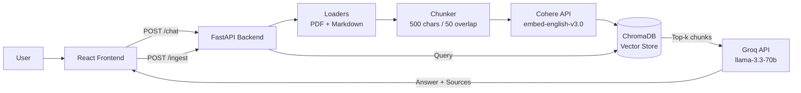

# AskStefan

> AI-powered RAG chatbot that answers questions about me based on my CV, project descriptions, and documents. Drop a new file in, hit ingest, and it knows everything.


<!--  -->

## Architecture



## Features

- **Multi-document RAG** -- drop any `.pdf` or `.md` into `backend/data/`, run `/ingest`, and it's instantly searchable
- **Idempotent ingestion** -- SHA-256 file hashing skips unchanged documents; `?force=true` reingests everything
- **Citation-aware answers** -- every response includes source cards with file, location, similarity score, and highlighted matching text
- **Glassmorphism UI** -- split layout with chat (60%) and visual source panel (40%), suggested prompts, social links
- **Mobile responsive** -- sources collapse behind a floating toggle button with slide-up sheet
- **Rate limit resilience** -- exponential backoff on both Cohere and Groq APIs; friendly toast messages for users
- **Source type inference** -- filenames like `*cv*` auto-classify as resume, `*project*` as project description, `blog*` as blog

## Quick Start

### Prerequisites

- Python 3.11+
- Node.js 20+
- [Groq API key](https://console.groq.com)
- [Cohere API key](https://dashboard.cohere.com)

### Local Development

```bash
# Clone
git clone https://github.com/stefanpesovic/askstefan.git
cd askstefan

# Backend
cd backend
python -m venv .venv && source .venv/bin/activate
pip install -r requirements.txt
cp .env.example .env
# Edit .env with your GROQ_API_KEY and COHERE_API_KEY
python run.py

# In another terminal -- Frontend
cd frontend
npm install
npm run dev
```

Then open `http://localhost:5173` and click a suggested prompt.

### Ingest Documents

```bash
# Ingest all documents in backend/data/
curl -X POST http://localhost:8000/ingest

# Force reingest (clears and reprocesses)
curl -X POST http://localhost:8000/ingest?force=true

# Check what's indexed
curl http://localhost:8000/sources
```

### Docker

```bash
# Create your .env
cp backend/.env.example backend/.env
# Edit backend/.env with your API keys

docker compose up --build
# Frontend: http://localhost:3000
# Backend:  http://localhost:8000
```

## API Reference

| Method | Endpoint | Description |
|--------|----------|-------------|
| `GET` | `/` | Welcome message with docs link |
| `GET` | `/health` | System status, chunk count, API readiness |
| `POST` | `/chat` | Ask a question (body: `{"question": "..."}`) |
| `POST` | `/ingest` | Index all documents from `data/` |
| `POST` | `/ingest?force=true` | Force reingest all documents |
| `GET` | `/sources` | List all ingested files with metadata |
| `GET` | `/docs` | Interactive Swagger UI |

### POST /chat -- Example

```bash
curl -X POST http://localhost:8000/chat \
  -H "Content-Type: application/json" \
  -d '{"question": "What are Stefan technical skills?"}'
```

```json
{
  "answer": "According to my CV, my technical skills include Python, JavaScript...",
  "sources": [
    {
      "chunk_id": "stefan_cv_pdf__page_1__0",
      "source_file": "stefan cv.pdf",
      "source_type": "resume",
      "location": "page 1",
      "text": "Languages: Python and JavaScript (daily)...",
      "similarity_score": 0.42
    }
  ],
  "latency_ms": 1288,
  "model": "llama-3.3-70b-versatile"
}
```

## Adding New Documents

The core value proposition: drop files and go.

1. Place any `.pdf` or `.md` file in `backend/data/`
2. Run `curl -X POST http://localhost:8000/ingest`
3. The chatbot immediately knows the new content

Source types are auto-inferred from filenames:

| Pattern | Source Type |
|---------|------------|
| `*cv*`, `*resume*` | `resume` |
| `*project*` | `project_description` |
| `blog*` | `blog` |
| `about*` | `about` |
| Everything else | `other` |

Markdown files split by `## H2` headings. PDFs split by page. All chunks preserve full source metadata.

## Engineering Decisions

**Why Cohere for embeddings + Groq for generation?**
Separation of concerns. Cohere's `embed-english-v3.0` produces high-quality 1024-dim vectors optimized for retrieval. Groq's `llama-3.3-70b` via their inference API gives fast, high-quality generation. Decoupling these means either can be swapped independently.

**Why ChromaDB over Pinecone/Weaviate?**
Zero infrastructure. ChromaDB runs as an embedded database with file persistence -- no server to manage, no account needed, works locally and in Docker. For a portfolio project with <1000 chunks, it's the right tool.

**Why SHA-256 idempotency?**
Production ingestion pipelines must be safe to re-run. Hashing each file and checking against stored hashes means `POST /ingest` is always safe -- it only processes genuinely new or changed content. This matters when the system runs on a schedule or multiple people can trigger ingestion.

**Why not streaming responses?**
Groq's inference is already fast (~1-2s for 150 tokens). SSE streaming would add complexity to both backend (async generators) and frontend (event source parsing) for marginal UX gain. If latency becomes an issue with larger context windows, streaming is the clear next step.

**Why glassmorphism?**
It signals modern, polished frontend work -- exactly what recruiters and tech leads evaluate in portfolio projects. The `backdrop-blur` + transparency combo creates visual depth without heavy design assets.

## Tech Stack

| Layer | Technology |
|-------|-----------|
| Backend | Python 3.11, FastAPI, LangChain text splitters |
| Embeddings | Cohere `embed-english-v3.0` (1024-dim) |
| LLM | Groq `llama-3.3-70b-versatile` |
| Vector Store | ChromaDB (persistent, cosine similarity) |
| Frontend | React 18, Vite 5, TailwindCSS 3 |
| Animations | Framer Motion |
| Testing | pytest + vitest |
| DevOps | Docker Compose, GitHub Actions CI |

## Project Structure

```
askstefan/
├── backend/
│   ├── app/
│   │   ├── main.py              # FastAPI app + lifespan
│   │   ├── config.py            # pydantic-settings
│   │   ├── models.py            # Pydantic schemas
│   │   ├── rag/
│   │   │   ├── loaders.py       # PDF + Markdown loaders
│   │   │   ├── chunker.py       # Text splitting
│   │   │   ├── embedder.py      # Cohere embeddings
│   │   │   ├── vectorstore.py   # ChromaDB wrapper
│   │   │   ├── retriever.py     # Similarity search
│   │   │   ├── generator.py     # Groq LLM generation
│   │   │   └── ingestion.py     # Orchestrator
│   │   └── routes/
│   │       ├── chat.py          # POST /chat
│   │       ├── ingest.py        # POST /ingest, GET /sources
│   │       └── health.py        # GET /health
│   ├── data/                    # Drop documents here
│   ├── tests/
│   └── Dockerfile
├── frontend/
│   ├── src/
│   │   ├── components/          # React components
│   │   ├── hooks/useChat.js     # Chat state management
│   │   ├── api/client.js        # Axios instance
│   │   └── utils/highlight.jsx  # Citation highlighting
│   ├── tests/
│   └── Dockerfile
├── docker-compose.yml
└── .github/workflows/ci.yml
```

## License

MIT

---

Built by [Stefan Pesovic](https://github.com/stefanpesovic) as part of a 5-day portfolio challenge.
